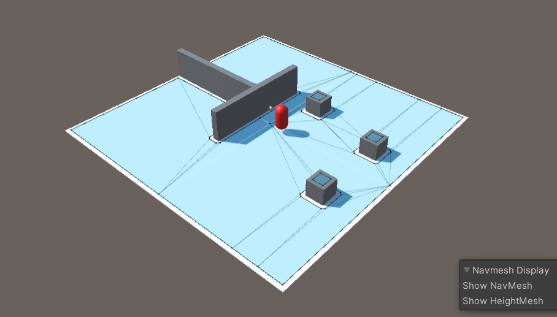

# Coordinated Movement and Formation

### Introduction

The aim of the project is to create movement and formation code for a postive game experience with a RTS-style of game.
In this reseach i will be using unity 3D. This paper will evolve with the progress made.

> Currently working on the States of the Units and, finding more research material



### TaskList
- [x] Units have PathFinding (From A to B)
- [ ] Collision Determination
- [ ] Predicted Positions
- [ ] Basic Unit Formation
- [ ] Add more to TaskList 


##### Resources
```
 + https://www.gamasutra.com/view/feature/3314/coordinated_unit_movement.php?print=1
 
 + https://www.gamedeveloper.com/programming/coordinated-unit-movement

```
